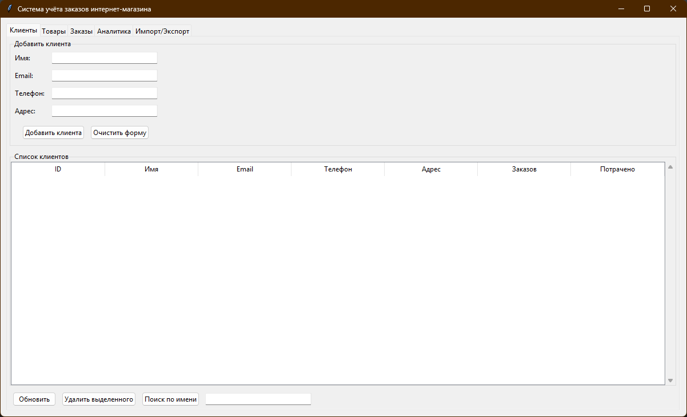
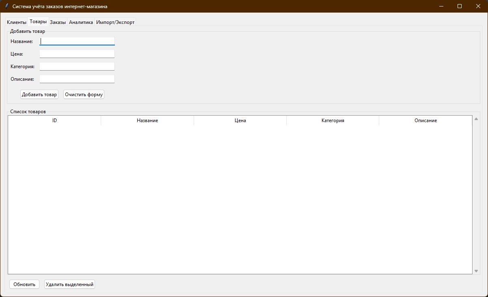
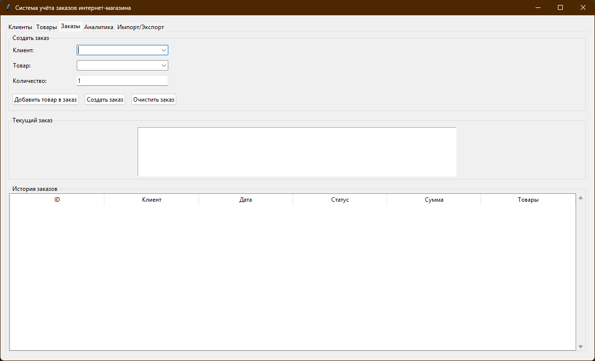
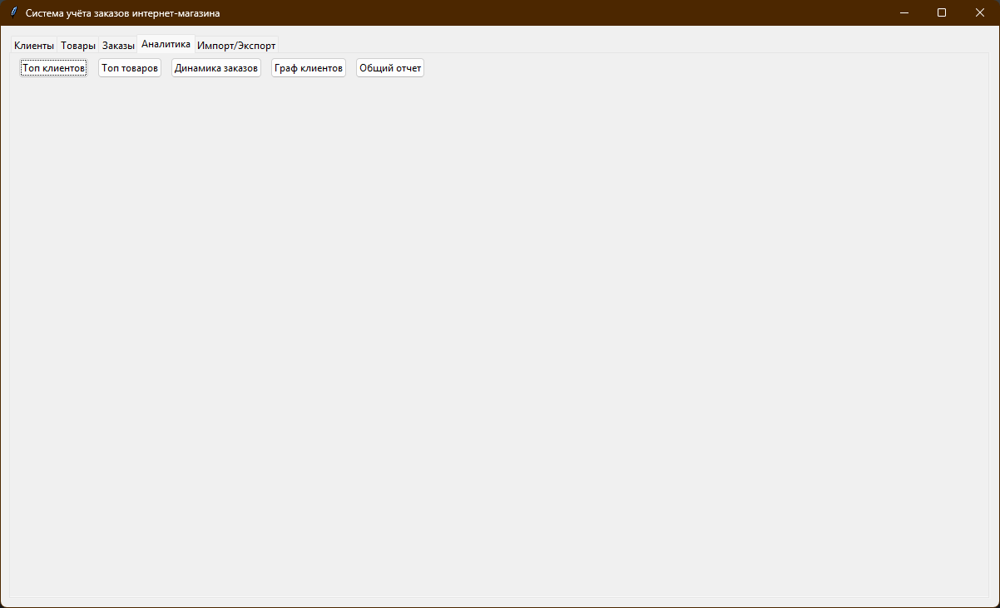
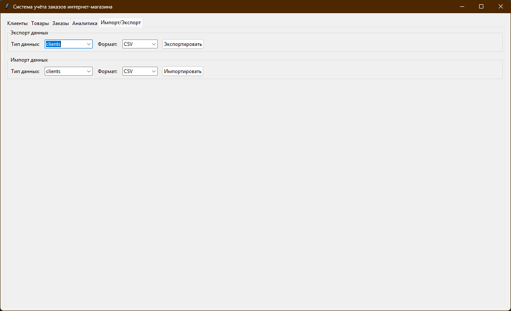

# Система учёта заказов интернет-магазина

Прототип промышленной системы учёта заказов, клиентов и товаров с графическим интерфейсом, базой данных и возможностью анализа данных.
## 🚀 Краткая инструкция по запуску

### 1. Клонирование и настройка
```bash
# Скачайте файлы проекта в папку online_store_manager
# Перейдите в папку проекта
cd online_store_manager
```
### 2. Установка зависимостей
```bash
pip install -r requirements.txt
```
### 3. Запуск приложения
```bash
python main.py
```
## Функциональность

### Основные возможности:
- 📝 Регистрация клиентов и их контактных данных
- 🛒 Добавление заказов и связанных товаров
- 🔍 Просмотр, фильтрация, сортировка заказов и клиентов
- 📊 Анализ данных и визуализация
- 📁 Импорт/экспорт данных в форматах CSV и JSON
- 🎯 Базовые инструменты администрирования через GUI

### Аналитика:
- Топ клиентов по количеству заказов
- Топ товаров по продажам
- Динамика количества заказов по датам
- Граф связей клиентов по общим товарам
- Общий отчет о продажах

## 📁 Описание модулей
### 🏗️ models.py
Основные классы данных системы:
* **_Person_** - базовый класс для представления человека
* **_Client_** - класс клиента интернет-магазина (наследуется от Person)
* **_Product_** - класс товара
* **_Order_** - класс заказа
* **_OrderItem_** - класс позиции в заказе

Ключевые особенности:
* Валидация email и телефонов с помощью регулярных выражений
* Инкапсуляция данных через свойства (properties)
* Автоматический расчет сумм заказов
* Методы преобразования в словари для сериализации

### 💾 db.py
Класс Database для работы с SQLite:
* Автоматическое создание таблиц при инициализации
* CRUD операции для клиентов, товаров и заказов
* Импорт/экспорт данных в форматах CSV и JSON
* Сохранение связей между сущностями

Основные методы:

* _**save_client(), save_product(), save_order()**_ - сохранение объектов
* _**load_clients(), load_products(), load_orders()**_ - загрузка данных
* _**export_to_csv(), export_to_json()**_ - экспорт данных
* _**import_from_csv(), import_from_json()**_ - импорт данных

### 📊 analysis.py
Класс DataAnalyzer для анализа данных:
* Статистика по клиентам и товарам
* Визуализация данных с использованием matplotlib и seaborn
* Построение графов связей с networkx
* Генерация отчетов о продажах

Основные функции анализа:

* **_get_top_clients_by_orders()_** - топ клиентов по заказам
* **_get_top_products_by_sales()_** - топ товаров по продажам
* **_get_orders_dynamics()_** - динамика заказов по датам
* **_create_clients_network()_** - граф связей клиентов
* **_generate_sales_report()_** - полный отчет о продажах

### 🖥️ gui.py
Главный класс OnlineStoreApp с графическим интерфейсом:
* Интерфейс на базе tkinter с вкладками
* Формы для добавления клиентов, товаров и заказов
* Таблицы для отображения данных
* Интеграция с модулем анализа для визуализации

Вкладки интерфейса:
* Клиенты - управление клиентской базой
* Товары - управление каталогом товаров
* Заказы - создание и просмотр заказов
* Аналитика - графики и отчеты
* Импорт/Экспорт - работа с файлами

### 🎯 main.py
Точка входа в приложение:
* Инициализация главного окна
* Создание экземпляра приложения
* Обработка ошибок запуска
* Возврат кода завершения

### 🧪 test_models.py & test_analysis.py
Модульные тесты:
* Тестирование создания и валидации объектов
* Проверка бизнес-логики расчетов
* Тестирование функций анализа данных
* Использование unittest framework

## Скриншоты





